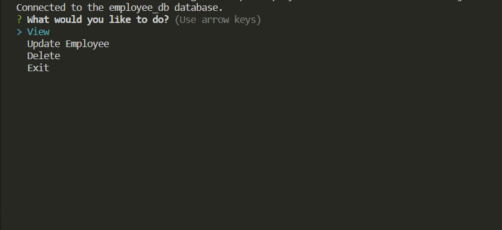

# <Employee-Tracker-CMS>

## Employee Tracker CMS
<a id="readme-top"></a>

<!-- TABLE OF CONTENTS -->
<details>
  <summary>Table of Contents</summary>
  <ol>
    <li><a href="#description">Description</a></li>
    <li><a href="#installation">Installation</a></li>
    <li><a href="#license">License</a></li>
    <li><a href="#contact">Contact</a></li>
    <li><a href="#acknowledgments">Acknowledgments</a></li>
  </ol>
</details>


<!-- ABOUT THE PROJECT -->
## Description
<details> <summary>Desktop View</summary>



</details>

**What?**

This is a <strong>CMS</strong> used to view, update or delete employees, their roles, and also their associated deparments. This was mainly done through the use of integrating Javascript and MySQL with the mySQL2 npm. 

**Technologies used**

- Javascript
- Node js
- mySQL

<strong>NPMs:</strong>
- Inquirer
- Console.table
- mySQL2
- nodemon

**Acquired Knowledge**

The initial code, besides mySQL (in the db folder), was all contained in one file (server.js). However this resulted in too many lines, making it hard to read. There were also many more indentations initially as the <i>'.then'</i> method of promises was used. I then refactored and rearranged the code into seperate files. The connection to the mySQL database now exits on the config file; Queries on the helpers/queries folder, and inquirer in the server.js file. 

There were many challenges and issues along the way, one of which I have yet to solve. But I have learnt a great deal of how mySQL query works, as well on the order of which code executes on javascript. The inquirer is rather long and thus it was easy to mess up, and a nightmare to find and solve issues. But it also taught me a bit of how to organise my code (even if it is still kind of messy). 

I am particularly proud of how my query files have come out. They are by far the most neat and clean code I have written to date.

<p align="right">(<a href="#readme-top">back to top</a>)</p>


<!--Installation-->
## Installation

Initialisation  
```
npm i  
```

Test (on tests folder)
```
npm run test
```

For program to run (main folder)
```
node server.js
```

<p align="right">(<a href="#readme-top">back to top</a>)</p>


<!-- LICENSE -->
## License

Distributed under the MIT License. See `LICENSE.txt` for more information.

<p align="right">(<a href="#readme-top">back to top</a>)</p>


<!-- CONTACT -->
## Contact

Samuel Wai Weng Yong - <a href="mailto:samuelyongw@gmail.com"> samuelyongw@gmail.com </a>

Project Link: [Employee-Tracker-CMS](https://github.com/KangaZero/Employee-Tracker-CMS)

Walkthrough Link : (https://drive.google.com/file/d/11zNT8mkoTAlcn6z6jO6mIN-a0-n2k4zV/view)

<p align="right">(<a href="#readme-top">back to top</a>)</p>


<!-- ACKNOWLEDGMENTS -->
## Acknowledgments

Here are some of the resources used as reference to build this personal portfolio

* [Choose an Open Source License](https://choosealicense.com)


<p align="right">(<a href="#readme-top">back to top</a>)</p>


<p align="center">Thanks for reading 😄!</p>
